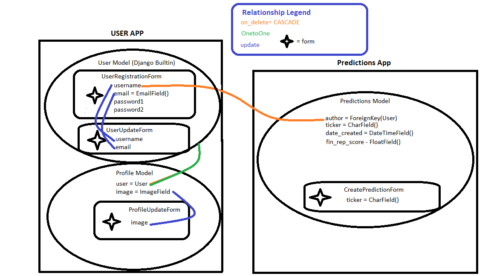

# IntelligentTrader

**Intelligent Trader** is an application that allows users to input a stock ticker, leverage machine learning models, and observe the predicted change in the financials of a given company a quarter into the future!

---

## Backend Structure

*Please don't roast me, this was before I learned about system modeling, but I think it does the trick.*



---

## User Instructions

To get started with the **IntelligentTrader** project, follow these steps:

1. Download and install Python if you haven't already.
2. Install the required dependencies:
    ```bash
    pip install django
    pip install crispy-bootstrap4
    pip install requests
    pip install os
    pip install joblib
    pip install pandas
    pip install scikit-learn
    pip install Pillow
    ```
3. Navigate to the project directory:
    ```bash
    cd /path/to/project
    ```
4. Set up your email configuration:
    - Open `settings.py` in the `tutorial` app.
    - Define the following constants for the **Forgot Password** feature:
      ```python
      EMAIL_HOST_USER = 'your-email@example.com'
      EMAIL_HOST_PASSWORD = 'your-email-password'
      ```
    - Get credentials using [Google App Passwords](https://myaccount.google.com/apppasswords).
5. Start the development server:
    ```bash
    python manage.py runserver
    ```

---

## Contributing

Thank you for your interest in contributing to **IntelligentTrader**! Contributions are always welcome. Please follow the guidelines below to ensure that your contributions can be easily reviewed and merged.

### How to Contribute

1. **Fork the Repository**
    - Start by forking the repository to your own GitHub account. This will allow you to freely make changes without affecting the original codebase.
   
2. **Clone the Forked Repository**
    - After forking the repo, clone it to your local machine:
      ```bash
      git clone https://github.com/your-username/project-name.git
      ```

3. **Create a New Branch**
    - Create a new branch for your work. The branch name should describe the work you’re doing:
      ```bash
      git checkout -b feature-name
      ```

4. **Make Your Changes**
    - Implement your feature, fix, or improvement. Ensure your code follows the project's coding standards and is well-documented.
    - If working on a bug, please make sure it is well-reported and addressed.

5. **Test Your Changes**
    - Run tests locally to ensure your changes do not break existing functionality. We use [pytest](https://pytest.org/) for testing:
      ```bash
      pytest
      ```

6. **Commit Your Changes**
    - Commit your changes with a clear and concise message explaining the purpose of your changes:
      ```bash
      git commit -m "Add feature or fix bug"
      ```

7. **Push Your Changes**
    - Push your changes to your forked repository:
      ```bash
      git push origin feature-name
      ```

8. **Create a Pull Request**
    - Create a pull request (PR) on the original repository. Select your branch and describe the changes you've made.
    - Provide a clear description of the issue you're addressing and the solution you've implemented.

---

### Code of Conduct

This project adheres to the [Contributor Covenant Code of Conduct](https://www.contributor-covenant.org/). By participating in this project, you agree to abide by its terms. Please be respectful and considerate towards others in the community.

---

### Reporting Bugs

If you encounter a bug, please open an issue on the GitHub Issues page. When reporting a bug:
- Provide steps to reproduce the issue.
- Include any relevant logs, error messages, or screenshots.
- Mention the version of Django and any other dependencies you're using.

#### Known Issues
- The project hasn't been migrated to Postgres DB yet (planned for the future).
- All users can currently view predictions made by other users. A user should only be able to see their own predictions.
- The Random Forest model is inefficient because it stores all financial data, but
